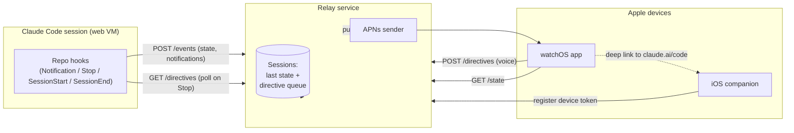
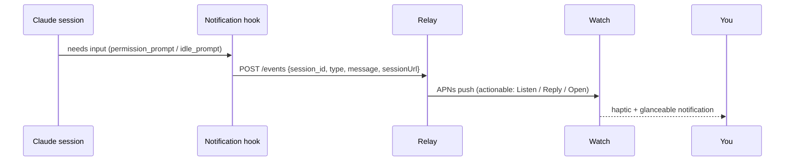
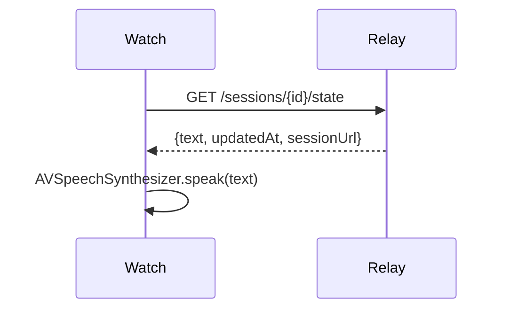
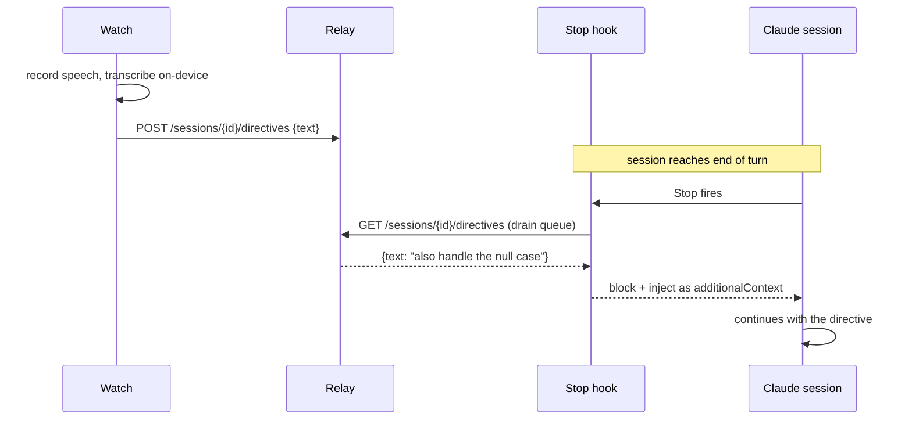

# claude-watch — Architecture & Build Plan

A companion app to drive Claude from an Apple Watch. This document is the design
of record; no application code exists yet.

---

## 1. Goals

Drive a Claude coding agent from your wrist, hands-free, while away from a screen.

1. **Notify me when the agent needs me.** Permission prompts, clarifying
   questions, errors, and "I'm done" — pushed to the watch as actionable
   notifications.
2. **Read me the last state aloud.** On demand (or on notification), speak the
   most recent assistant turn / session summary using the watch's text-to-speech.
3. **Take a voice directive.** I dictate a reply or new instruction; the watch
   transcribes it and sends it back into the running Claude session.

Audio in/out and transcription are **native Apple Watch functionality**
(`AVSpeechSynthesizer`, `SFSpeechRecognizer` / dictation). This app orchestrates
*when* and *what* — it is not a speech engine.

### Non-goals (for now)

- A full code editor or diff viewer on the watch (deep-link to the Claude mobile
  app / `claude.ai/code` for anything rich).
- Running the model on-device.
- Replacing the Claude mobile app — we complement it for glanceable, hands-free
  moments.

---

## 2. The key constraint that shapes everything

The transport choice is **Claude Code on the web first**, generalizing to
**local Claude Code hooks** later. Researching how Claude Code on the web
actually works surfaced one decisive fact:

> **There is no public REST API to observe or drive a Claude Code (web) session
> programmatically.** You interact with a session through `claude.ai/code` and
> the Claude mobile app. Sessions are started via the web UI, `claude --remote`,
> Slack, or [Routines](https://code.claude.com/docs/en/routines).

So we cannot "poll the session for new messages" or "POST a reply to the
session" through an official API. But two supported mechanisms give us
everything we need:

1. **Hooks committed to the repo run inside cloud sessions.** A repo's
   `.claude/settings.json` hooks execute in the web VM. So a `Notification` or
   `Stop` hook can read session state and **POST to an external relay** of our
   own. ([Hooks reference](https://code.claude.com/docs/en/hooks),
   [what carries into cloud sessions](https://code.claude.com/docs/en/claude-code-on-the-web).)
2. **The `Stop` hook can block a turn and inject text** to continue the
   conversation (`hookSpecificOutput.additionalContext`, or exit code 2 with
   stderr). That is the channel for **getting a voice directive back into the
   session** without any private API.

This turns the problem into something fully buildable on documented surfaces:

```
Claude session  --(repo hook: POST)-->  Relay  --(APNs)-->  Watch
Watch  --(POST directive)-->  Relay  --(Stop hook polls + injects)-->  Claude session
```

### Constraints to design around (from the web docs)

- **Outbound network is gated.** Cloud environments default to **Trusted**
  (allowlisted domains only). To let a hook POST to our relay, the environment
  must use **Custom** network access with the relay domain allowlisted, or the
  relay must be reachable as an MCP connector (connector traffic is routed
  through Anthropic and doesn't need allowlisting). See
  [Network access](https://code.claude.com/docs/en/claude-code-on-the-web#network-access).
- **No secrets store yet.** A relay auth token lives as an environment variable,
  visible to anyone who can edit the environment. Scope the token narrowly and
  rotate it.
- **Only repo-committed config runs in the cloud.** User-level `~/.claude`
  hooks/skills do **not** carry over. The hook bridge must live in the repo
  (or in each repo you want to drive from the watch).
- **Deep links work.** A session can read `CLAUDE_CODE_REMOTE_SESSION_ID` and
  build its transcript URL:
  `https://claude.ai/code/${ID/#cse_/session_}`. The watch/phone uses this to
  hand off to the full Claude experience.
- **Mobile app already does push.** Claude's mobile app can already notify and
  let you interact with web sessions. Where the watch overlaps with that, we
  defer to it (deep link) rather than reimplement; our value-add is the
  glanceable + voice loop.

---

## 3. System overview

Four components:

| Component | Responsibility | Tech |
| --- | --- | --- |
| **Hook bridge** | Repo-committed hook scripts that emit events from a Claude session to the relay, and pull queued directives back in | Bash + `jq` + `curl`, in `.claude/` |
| **Relay service** | Tiny stateful service: receives session events, stores last state per session, fans out APNs pushes, queues directives | Node/TS (Bun or Express) + SQLite/Redis |
| **iOS companion app** | Auth, APNs device-token registration, settings, rich session view, deep-links to Claude | SwiftUI (iOS target) |
| **watchOS app** | Receive notifications, read state aloud, capture + transcribe voice, send directives | SwiftUI (watchOS target) |



---

## 4. Core use-case flows

### 4.1 Notify me when the agent needs me



`Notification` hook input includes `notification_type` (`permission_prompt`,
`idle_prompt`, `elicitation_dialog`, …), `message`, `session_id`,
`transcript_path`, `cwd`. We map `notification_type` → notification category so
the watch can show the right actions.

### 4.2 Read me the last state / session summary

Two ways the relay gets "the last state":

- On **every `Stop`** (turn end), the hook reads the last assistant message from
  the `transcript_path` JSONL and POSTs it as the session's current state.
- On **`SessionEnd`**, the hook posts a final summary.



The watch can auto-read on a notification tap, or read on demand from a
complication / app launch.

### 4.3 Take a voice directive



This is the elegant part: the `Stop` hook is both the **state emitter** and the
**directive injector**. If the queue is empty it lets the turn end normally; if
not, it blocks and feeds the directive in, keeping Claude going hands-free.

> ⚠️ **To verify early:** confirm the `Stop`-block-and-inject behavior works in
> *cloud* sessions specifically (it's a general hooks feature, but cloud has its
> own constraints). This is the first thing to prototype — flow 4.3 is the
> riskiest assumption. If injection isn't reliable in the cloud, fall back to
> posting the directive as a GitHub PR/issue comment that a
> [Routine](https://code.claude.com/docs/en/routines) or auto-fix picks up, or
> defer voice-in to the Phase 2 (local) transport.

---

## 5. The hook bridge (Phase 1 detail)

Lives in the target repo so it runs in the cloud session. Example
`.claude/settings.json`:

```json
{
  "hooks": {
    "Notification": [
      { "hooks": [ { "type": "command", "command": "\"$CLAUDE_PROJECT_DIR\"/.claude/watch/notify.sh" } ] }
    ],
    "Stop": [
      { "hooks": [ { "type": "command", "command": "\"$CLAUDE_PROJECT_DIR\"/.claude/watch/on_stop.sh" } ] }
    ],
    "SessionStart": [
      { "matcher": "startup|resume", "hooks": [ { "type": "command", "command": "\"$CLAUDE_PROJECT_DIR\"/.claude/watch/session_start.sh" } ] }
    ],
    "SessionEnd": [
      { "hooks": [ { "type": "command", "command": "\"$CLAUDE_PROJECT_DIR\"/.claude/watch/session_end.sh" } ] }
    ]
  }
}
```

Sketch of `on_stop.sh` (state emit + directive injection):

```bash
#!/bin/bash
set -euo pipefail
input=$(cat)
sid=$(jq -r '.session_id' <<<"$input")
transcript=$(jq -r '.transcript_path' <<<"$input")
url="https://claude.ai/code/${CLAUDE_CODE_REMOTE_SESSION_ID/#cse_/session_}"

# 1) Emit last assistant message as current state
last=$(tail -n 200 "$transcript" | jq -rs '[.[] | select(.role=="assistant")] | last | .content // ""')
curl -fsS -X POST "$RELAY_URL/sessions/$sid/state" \
  -H "Authorization: Bearer $RELAY_TOKEN" -H "Content-Type: application/json" \
  -d "$(jq -nc --arg t "$last" --arg u "$url" '{text:$t, sessionUrl:$u}')" || true

# 2) Drain any queued voice directives; if present, inject and keep going
directive=$(curl -fsS -X POST "$RELAY_URL/sessions/$sid/directives/drain" \
  -H "Authorization: Bearer $RELAY_TOKEN" || echo '')
text=$(jq -r '.text // empty' <<<"$directive" 2>/dev/null || true)
if [ -n "$text" ]; then
  jq -nc --arg c "$text" '{decision:"block", hookSpecificOutput:{hookEventName:"Stop", additionalContext:$c}}'
fi
```

Notes:
- `transcript_path` parsing is schema-sensitive; the real script will read the
  JSONL robustly (the snippet is illustrative).
- Every `curl` to the relay is best-effort (`|| true`) so the hook never breaks
  the session.
- Requires the environment's network access to allow `$RELAY_URL`'s domain.

### Distribution

A small installer makes the bridge one command per repo: `claude-watch init`
drops `.claude/watch/*`, patches `.claude/settings.json`, and prints the
environment variables to set (`RELAY_URL`, `RELAY_TOKEN`) and the network-allow
domain. Ship it as a Claude Code **plugin / skill** so it's reusable.

---

## 6. Relay service

Deliberately tiny and stateless-ish (state is just per-session last message +
directive queue).

**Endpoints**

| Method | Path | Caller | Purpose |
| --- | --- | --- | --- |
| `POST` | `/sessions/:id/state` | hook | store last assistant message + session URL |
| `POST` | `/events` | hook | notification event → triggers APNs push |
| `GET` | `/sessions/:id/state` | watch | fetch text to read aloud |
| `POST` | `/sessions/:id/directives` | watch | enqueue a voice directive |
| `POST` | `/sessions/:id/directives/drain` | hook | atomically pop queued directives |
| `POST` | `/devices` | iOS/watch | register APNs device token |
| `GET` | `/sessions` | watch/iOS | list active sessions |

**Data model** (SQLite is plenty):
- `sessions(id, title, last_state_text, last_state_url, updated_at)`
- `directives(id, session_id, text, created_at, consumed_at)`
- `devices(token, platform, user_id, created_at)`

**Push:** APNs via token-based auth (`.p8` key). Notification payloads carry a
`category` (mapped from `notification_type`) and the `session_id` so taps route
to the right screen. Use `apns-push-type: alert` with sound + a custom category
for action buttons (Listen / Reply / Open in Claude).

**Auth:** single-user to start — one bearer token shared by the hook and a
per-device token for the apps. Multi-user/OAuth is a later concern.

**Hosting:** anything with a stable HTTPS domain (Fly.io / Render / a small VM).
The domain must be added to the cloud environment's allowed domains.

---

## 7. Apple apps (SwiftUI: watchOS + iOS companion)

### watchOS app
- **Notifications:** `UNNotificationCategory` with actions (Listen, Reply,
  Open). Background-delivered via APNs through the paired phone or directly.
- **Read aloud:** `AVSpeechSynthesizer` over the fetched state text. Handle
  audio session routing (speaker vs. AirPods).
- **Voice in:** `SFSpeechRecognizer` / the watch dictation UI to capture and
  transcribe, then `POST /directives`. On-device recognition where available for
  latency/privacy.
- **Glance:** a complication / smart-stack widget showing "agent waiting" state
  and last-updated time.

### iOS companion app
- Account + relay configuration (URL, token via QR or paste).
- APNs registration, device-token upload to the relay.
- Richer session list and a readable transcript view.
- Deep-link button → opens `claude.ai/code/session_…` (or the Claude app).

### Project structure (planned)
```
ClaudeWatch.xcodeproj (or Swift package + Tuist/XcodeGen)
├── ClaudeWatch/                # iOS companion target
├── ClaudeWatch Watch App/      # watchOS target
├── Shared/                     # models, relay client, audio helpers
└── ...
```
Stack decision: native SwiftUI with a watchOS app + iOS companion (per your
preference). Shared networking/model code in a `Shared` framework.

---

## 8. Security & privacy

- **Relay token exposure:** environment variables are visible to environment
  editors and there's no secrets store — treat `RELAY_TOKEN` as low-trust, scope
  it to the relay only, and rotate. Never put it in the repo.
- **Transcript content leaves the VM** to the relay. The relay should store the
  minimum (last message + short queue), encrypt at rest, and expire data
  quickly. Document this clearly; sessions can contain private code.
- **APNs:** token-based (.p8), least-privilege topic.
- **On-device transcription** preferred so raw audio never hits a server.
- **Voice directives are powerful** (they steer an autonomous agent). Consider
  requiring confirmation for directives that look like destructive instructions,
  and never auto-approve permission prompts from the watch without explicit user
  action.

---

## 9. Roadmap

**Phase 0 — De-risk (do this first).** Prototype flow 4.3 end-to-end with curl:
a throwaway relay + `Stop` hook in a cloud session, confirm block-and-inject
works in the cloud and that outbound POST to a custom domain is allowed. This
validates the single riskiest assumption before any app code.

**Phase 1 — Notify + Read (web transport).**
- Relay MVP (`/state`, `/events`, `/devices`, APNs).
- Hook bridge: `Notification` + `Stop`(state emit only) + `SessionEnd`.
- watchOS: receive push, fetch + read state aloud. iOS: token registration,
  deep-link.
- Outcome: you get pinged and can listen, fully hands-free.

**Phase 2 — Voice in.**
- Add directive queue + `Stop` drain/inject.
- watchOS dictation → `POST /directives`.
- Confirmation UX for risky directives.

**Phase 3 — Polish & generalize to local Claude Code.**
- Same relay, but hooks installed in local `~/.claude` / project settings drive
  local sessions too (this is the "hooks + relay" transport you also wanted).
- Multi-session management, complications/smart-stack, multi-user auth.
- `claude-watch init` plugin/skill for one-command setup per repo.

---

## 10. Open questions

1. **Stop-inject in cloud** — confirmed working? (Phase 0 settles this.)
2. **Directive timing** — injecting only at `Stop` means a directive waits for
   the current turn to end. Acceptable, or do we want to interrupt mid-turn?
   (Mid-turn interruption has no hook surface; would require the mobile app.)
3. **Session discovery** — how does the watch know which session is "current"
   when several run in parallel? Likely: most-recently-active, with a picker.
4. **APNs delivery to watch** — direct vs. via paired iPhone forwarding; affects
   whether the iOS companion is strictly required for notifications.
5. **Relay hosting & domain** — pick a host so we can allowlist its domain in the
   environment config.

---

## Prior art

Two existing projects implement what this plan calls the *local* transport, and
both validate the hook/bridge + SwiftUI approach. **Both are LAN/local** — a Mac
on your network runs the bridge; the watch finds it over Bonjour. Neither works
truly remotely without a VPN back to that Mac.

**`shobhit99/claude-watch`** ([repo](https://github.com/shobhit99/claude-watch))
- Mac **Node bridge** receives Claude Code hook events, streams over **SSE**, and
  **blocks on permission requests** until approved.
- **Bonjour/mDNS** discovery; iPhone relays to the watch via **WCSession**.
- SwiftUI iOS + watchOS, voice **input** (dictation), haptics, 6-digit pairing.

**Handwave** by Zack Proser ([write-up](https://zackproser.com/blog/handwave))
- Mac **Node/Express bridge** scans `~/.claude/projects/` to **discover all
  sessions**, exposes them over HTTP + **SSE**, advertises as `_handwave._tcp`
  via mDNS. SwiftUI watchOS client.
- **Voice in *and* out** (so it already does the TTS "read aloud" we wanted) and
  **multiplexes across sessions** from the wrist.
- Drives sessions via the **Claude Agent SDK session-resumption** feature
  (resume by session id, feed a new prompt) — cleaner than a `Stop`-hook
  block-and-inject for *local* sessions.

| Capability | shobhit99 | Handwave | This plan |
| --- | --- | --- | --- |
| Local Claude Code (LAN) | ✅ | ✅ | Phase 3 |
| Permission approvals from wrist | ✅ | — | ✅ |
| Voice input | ✅ | ✅ | ✅ |
| Read state aloud (TTS out) | ❌ | ✅ | ✅ |
| Multiplex multiple sessions | partial | ✅ | ✅ |
| SwiftUI watch (+ iOS) | ✅ | ✅ (watch) | ✅ |
| **Cloud / Claude Code on the web transport** | ❌ | ❌ | ✅ Phase 1 |
| **Truly remote (relay + APNs, no Mac/VPN)** | ❌ | ❌ | ✅ |

**Implications.**
1. Local LAN voice control — including TTS readout and multi-session — is
   essentially **already solved twice**. Our remaining differentiator is
   narrow but real: **driving Claude Code on the web (cloud) sessions from
   anywhere via a relay + APNs, with no Mac running on your network.**
2. **Adopt Agent SDK session-resumption** as the local driving mechanism
   (Phase 3), in place of the `Stop`-hook inject trick. It does *not* help the
   cloud transport (no local `~/.claude/projects` store in a web VM), so Phase 1
   still relies on the repo hook bridge.

Strategy decision pending: fork/extend an existing LAN project and bolt on the
cloud+APNs layer, vs. build fresh web-first.

### Candidate: reverse-engineered web API for cloud sessions

[`cyber-wojtek/Claude-API`](https://github.com/cyber-wojtek/Claude-API) is an
unofficial async-Python wrapper that reverse-engineers the **claude.ai *chat*
API** (list/resume/delete conversations, send messages, stream). Per its README
it targets the chat interface, **not** the code sandbox (`claude.ai/code`), so
out of the box it does **not** read or resume Claude Code cloud coding sessions.

What it proves is the **technique**: the web/iOS/Android clients all talk to an
internal backend, and the same approach pointed at the `claude.ai/code`
endpoints would give exactly what the official API lacks — list cloud sessions,
read the latest turn, send a message, resume — *directly*. That would let us drop
the hook-bridge + `Stop`-inject mechanism for the cloud transport.

**Tradeoff — high reward, high risk.** Treat as a candidate, not the default:

| | Hook-bridge (default) | Reverse-engineered web API |
| --- | --- | --- |
| Supported surface | ✅ documented hooks | ❌ unofficial, ToS risk |
| Stability | ✅ | ❌ internal API changes without notice |
| Auth exposure | scoped `RELAY_TOKEN` | `sessionKey` **on-device only** (Keychain) — see below |
| Covers cloud `/code` today | ✅ | ❌ (chat only; would need new capture work) |
| Cleanliness if it worked | hooks are a workaround | ✅ direct read/send/resume |

**Keep the `sessionKey` on-device, never on the relay.** The credential lives in
the iOS app's Keychain (optionally iPhone-only, with the watch proxying through
it via WCSession so the watch stays out of the credential path). This makes the
blast radius "device compromise = full account" — the *same* exposure the
official Claude iOS app already carries — rather than "relay compromise = full
account." That resolves the main security objection.

This yields a **hybrid architecture** that is arguably the best of both:

- **Relay = notifications only.** Lightweight "agent needs you" pings from the
  repo hook (scoped `RELAY_TOKEN`) → APNs push. No `sessionKey`, no session
  content. Still required because timely background notifications can't come from
  device-side polling alone.
- **Device = all session I/O.** Holds `sessionKey` in Keychain and calls the
  `/code` API directly to read the latest turn, speak it (TTS), and send/resume
  with the voice directive.

Residual risks that remain regardless: it's an **unofficial API** (ToS +
breakage), and the `/code` endpoints **still need to be captured** (the existing
library covers chat only). Good for a personal/experimental build that accepts
those; the hook-only path stays fully on supported surfaces if you don't.

#### The specific ToS conflict (and why it's not just theoretical)

Claude Code on the web runs on a **Pro/Max subscription**, governed by the
**Consumer Terms of Service** (not the Commercial Terms, which cover API keys).
The Consumer Terms permit automated access **only through an Anthropic API key**.
Driving a `claude.ai/code` session with a captured `sessionKey` conflicts with
**Consumer Terms §3 "Use of our Services"**:

- **Automated access (direct hit):** *"Except when you are accessing our Services
  via an Anthropic API Key or where we otherwise explicitly permit it, to access
  the Services through automated or non-human means, whether through a bot,
  script, or otherwise."*
- **Reverse engineering:** *"To decompile, reverse engineer, disassemble, or
  otherwise reduce the Services to human-readable form…"*
- **Scraping:** *"To crawl, scrape, or otherwise harvest data or information from
  the Services other than as permitted…"*
- **Credentials:** account credentials may not be shared/made available; using
  the `sessionKey` outside the official client is in tension with this.

**Enforcement precedent:** in early 2026 Anthropic blocked third-party
"harnesses" (OpenClaw/OpenCode) that piloted users' *subscription* accounts via
web/OAuth auth to drive automated workflows. A watch app driving a `/code`
subscription session via a captured `sessionKey` **is** that pattern, so the
realistic risk is **account suspension**, not merely breakage.

**Consequence for strategy:** the hook-bridge default stays clean — hooks are a
first-party feature, the relay carries only notification pings, and model access
happens inside the sanctioned Claude Code session, not via an external script.
The only fully sanctioned programmatic access is an **API key under the
Commercial Terms**, which is a *separate* agent — not "drive my existing
subscription cloud session."

Sources: Anthropic [Consumer Terms](https://www.anthropic.com/legal/consumer-terms),
[Usage Policy](https://www.anthropic.com/legal/aup); enforcement reporting
([VentureBeat](https://venturebeat.com/technology/anthropic-cracks-down-on-unauthorized-claude-usage-by-third-party-harnesses)).

## References

- [Claude Code on the web](https://code.claude.com/docs/en/claude-code-on-the-web)
- [Hooks](https://code.claude.com/docs/en/hooks)
- [Routines](https://code.claude.com/docs/en/routines)
- [Remote Control](https://code.claude.com/docs/en/remote-control)
